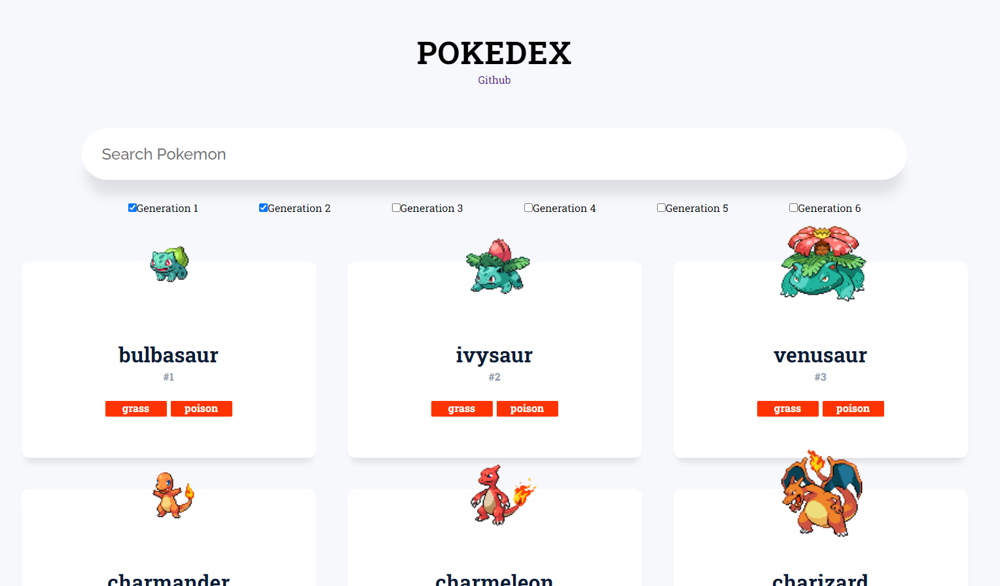

## <h1 align="center">Pokedex</h1>

---

Using an API called pokeAPI and ReactJS, this website displays every pokemon ranging from the first pokemon to the 900th pokemon.

Users can specify the number of pokemon displayed by entering the value in the textbox

If the user enters a value between 1 - 900, that amount of Pokemon will be displayed. Note that entering a negative number will return a message stating it must be a value greater than 0

