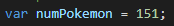
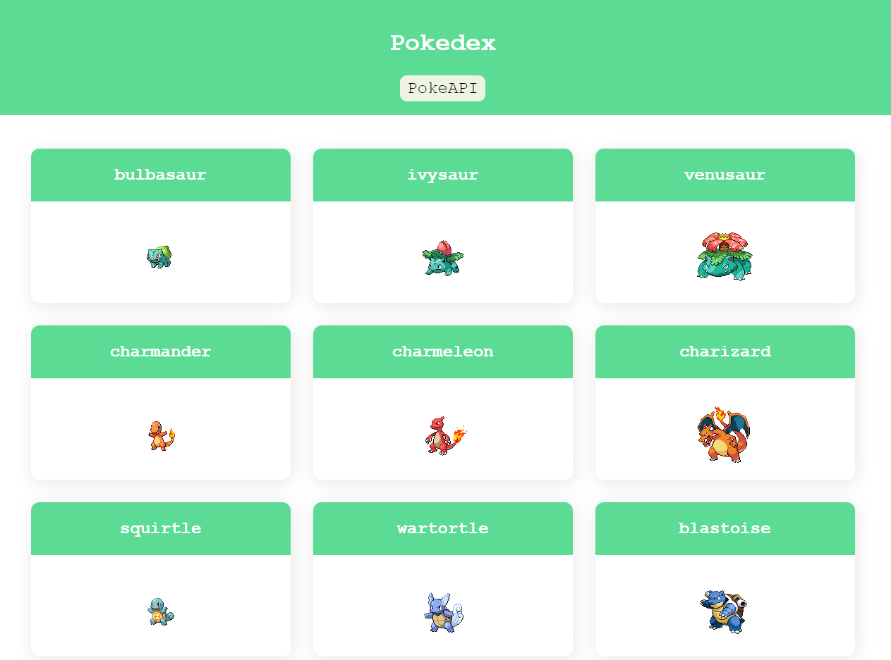

---

## <h1 align="center">Pokedex</h1>

Using an API called PokeAPI and JavaScript, the website generates entries for every pokemon listing their name and sprites. Users can change the number of pokemon entries by changing the variable 

Found in the JavaScript file

By Default the number of pokemon listed will be the original 151 pokemon.

PokeAPI: https://pokeapi.co/

---

