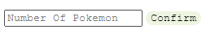

---

## <h1 align="center">Pokedex</h1>

Using an API called PokeAPI and JavaScript's XMLHttpRequest, the website generates entries for every pokemon listing their name and sprites. Users can change the number of pokemon entries by inputing the number of Pokemon they want into the textbox:

Note: By Default the number of pokemon listed will be the original 151 pokemon.

PokeAPI: https://pokeapi.co/

---

